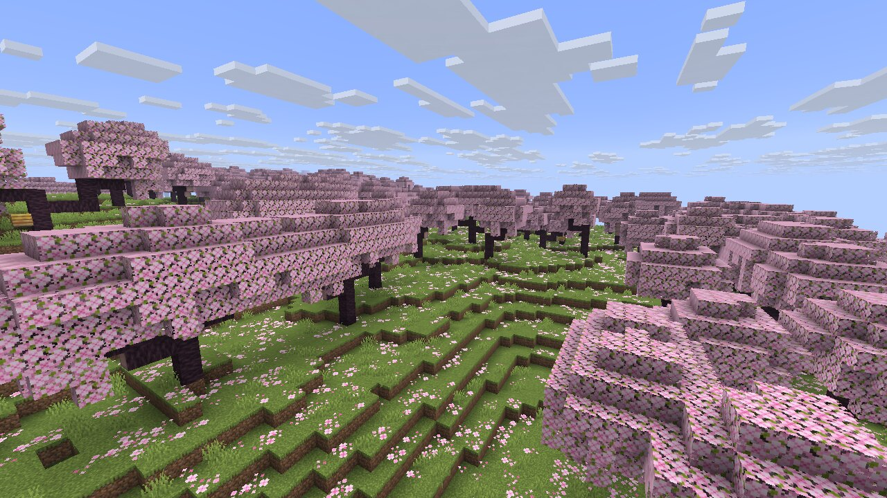
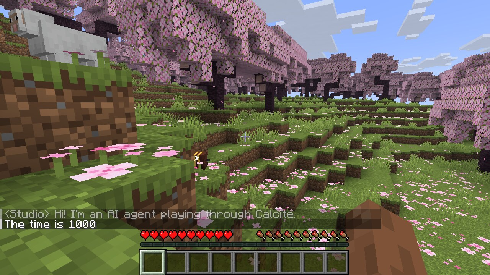
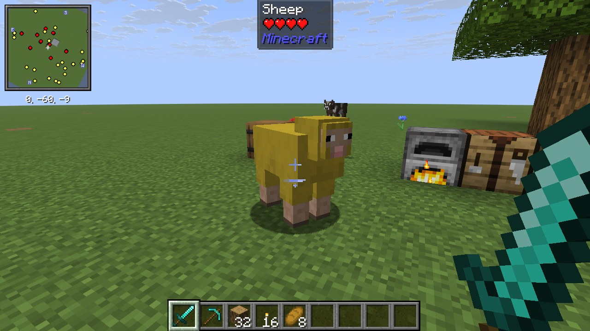
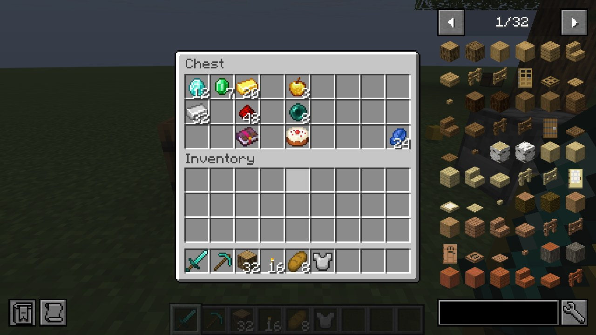

# Calcite 方解石

[](https://github.com/bkm016/Calcite/actions/workflows/ci.yml)
[](https://www.npmjs.com/package/@bkm016/calcite)
[](LICENSE)

Calcite 用于以编程方式驱动**真实的 Minecraft Java 版客户端**。它负责下载与启动游戏、加入服务器，并提供读取客户端状态与实体、发送聊天和指令、截图等能力。Calcite 以三种形式提供：

- **命令行工具**（`calcite`）
- **MCP 服务器**：供 Claude、Cursor 等 AI Agent 直接调用
- **Node.js 库**

适用场景包括服务端插件与模组的端到端测试、AI Agent 在游戏内的感知与操作，以及服务器的自动化巡检。

<p align="center">
  
  
</p>
<p align="center"><sub>两张图均由 Calcite 在无显卡的 Linux 云服务器上截取（Minecraft 26.3，Xvfb + Mesa 软件渲染）。右图为 Agent 发送聊天与指令后的画面。</sub></p>

## 目录

- [特性](#特性)
- [环境要求](#环境要求)
- [安装](#安装)
- [命令行](#命令行)
- [MCP 服务器](#mcp-服务器)
- [Node.js API](#nodejs-api)
- [平台与账号](#平台与账号)
- [渲染模式](#渲染模式)
- [模组](#模组)
- [扩展](#扩展)
- [版本兼容性](#版本兼容性)
- [数据目录与环境变量](#数据目录与环境变量)
- [故障排查](#故障排查)
- [工作原理](#工作原理)
- [许可](#许可)

## 特性

- **支持所有版本**：可启动 Mojang 发布的任意版本，包括正式版与快照；1.14.4 及以上版本支持全部探针功能。
- **跨平台**：Linux、Windows、macOS。
- **账号**：支持离线账号，也支持微软正版账号。正版账号使用设备码登录，凭据持久保存并自动刷新。
- **无显卡环境截图**：在 Linux 服务器上通过 Xvfb 与 Mesa 软件渲染完成截图。
- **模组加载器**：一行参数安装 Fabric、Forge 或 NeoForge，并从本地文件、URL 或 Modrinth 加载模组（自动补全前置依赖），探针功能在模组环境中同样可用。
- **玩家操作**：转向、移动、A* 寻路（绕墙、跳台阶、安全下落）、攻击、使用物品与方块、挖掘、切换快捷栏、丢弃物品，以及打开箱子等容器并点击槽位。操作走原版客户端逻辑，与真实玩家输入等价。
- **合成与熔炉**：按配方书合成物品（2×2 用背包合成格，3×3 自动打开附近的工作台），在容器与背包之间按物品搬运，可直接给熔炉装原料和燃料。
- **面向 Agent 的感知**：周边俯视字符地图、按 ID 或通配符搜索方块，以及受伤、死亡、背包变化、容器开关等内置游戏事件。
- **长时操作**：寻路、挖掘、合成可在后台运行，随时查询进度或取消；受到伤害时可自动中止。
- **按需渲染**：默认不渲染画面，截图时临时渲染。单次截图约 0.5 秒，进服后首次截图需等待区块编译，约 2–4 秒。
- **Java 自动管理**：按游戏版本自动选择 Java（render `off` 时原本需要 Java 8 的版本改用 Java 17，HeadlessMC 3 的 LWJGL 替身不支持 Java 8）；本机缺少时从 Eclipse Adoptium 下载 Temurin，并校验 SHA-256。HeadlessMC 3 本身运行在 Java 25 上，同样按需下载。
- **可扩展**：第三方可用 Java 编写扩展 jar，为 bot 增加自定义命令与事件；游戏内的模组也可以零依赖地注册命令。Node.js、MCP、命令行均可直接调用，见[扩展](#扩展)。
- **自动重连**：掉线或崩溃后按指数退避自动重连。
- **多客户端**：一个进程可同时管理多个相互隔离的客户端实例。

## 环境要求

| 项目 | 要求 |
| --- | --- |
| Node.js | 20.18.1 或更高版本 |
| Java | 无需预装；缺少时自动下载（游戏所需版本，以及 HeadlessMC 所需的 Java 25） |
| 磁盘 | 每个游戏版本约 0.5–1 GB，资源文件在各版本间共享 |
| Linux 截图 | `xvfb`、`libgl1-mesa-dri`；Minecraft 26.x 另需 `libegl1`、`libegl-mesa0` |

Debian / Ubuntu 安装截图依赖：

```bash
sudo apt install xvfb libgl1-mesa-dri libegl1 libegl-mesa0
```

## 安装

```bash
npm install -g @bkm016/calcite
calcite doctor
```

`calcite doctor` 用于检查 Node.js、Java、显示环境、EGL、已保存账号以及 Mojang 服务的连通性。

## 命令行

### 快速开始

```bash
# 以离线账号 Bot1 进入服务器
calcite launch play.example.com -V 1.21.11 -n Bot1
```

客户端进服后，终端进入交互模式：

- 直接输入文本：发送聊天
- 以 `/` 开头：执行指令
- 以 `:` 开头：控制命令，见下表

| 交互命令 | 说明 |
| --- | --- |
| `:state` | 输出当前游戏状态 |
| `:ents [半径]` | 列出附近实体，默认半径 32 |
| `:shot [文件]` | 截图并保存为 PNG |
| `:render on\|off` | 开启或关闭持续渲染 |
| `:respawn` | 死亡后重生 |
| `:look <yaw> <pitch>` / `:lookat <x> <y> <z>` | 设置视角 / 看向坐标 |
| `:around [半径]` | 周边俯视地图、附近方块统计与实体 |
| `:find <方块> [半径]` | 搜索方块，支持通配符，如 `*_ore` |
| `:goto <x> <z> [y]` | 寻路走到指定坐标 |
| `:move <按键,...> [tick]` | 按住按键若干 tick（默认 20），按键为 `forward`、`back`、`left`、`right`、`jump`、`sneak`、`sprint`、`attack`、`use` |
| `:stop` | 停止当前移动、挖掘等持续操作 |
| `:task` | 查看正在运行的长时操作及进度 |
| `:attack [实体ID]` | 攻击指定实体；省略时攻击准星所指 |
| `:use [实体ID \| x y z] [tick]` | 右键实体或方块；省略目标时使用手中物品，可指定按住时长 |
| `:dig <x> <y> <z>` | 挖掘方块直至破坏 |
| `:block <x> <y> <z>` / `:target` | 查看方块 / 查看准星目标 |
| `:inv` / `:slot <0-8>` | 查看背包 / 切换快捷栏 |
| `:craft <物品> [数量]` | 合成物品 |
| `:container` / `:close` | 查看 / 关闭当前打开的容器 |
| `:transfer <物品> [数量] [inventory]` | 把物品放进当前容器（加 `inventory` 则取回背包） |
| `:click <槽位> [按键] [模式]` | 点击容器槽位，模式见下文 |
| `:drop [all]` | 丢弃手中物品（`all` 丢弃整组） |
| `:events [名称正则]` | 最近的游戏事件 |
| `:ext` | 列出扩展命令 |
| `:call <命令> [JSON 参数]` | 调用扩展命令，例如 `:call hud.tablist {"limit":5}` |
| `:quit` | 退出并关闭客户端 |

### 命令一览

| 命令 | 说明 |
| --- | --- |
| `calcite launch [server]` | 启动客户端并在终端中交互；`-w <存档>` 进入单人世界 |
| `calcite install [version]` | 预下载指定版本（客户端、库、资源、Java），不启动游戏；`-l, --loader` 同时安装模组加载器 |
| `calcite versions` | 列出可用版本（`-t release\|snapshot\|old_beta\|old_alpha\|all`，`-l <数量>`） |
| `calcite login` | 微软账号登录（设备码） |
| `calcite accounts` | 列出已保存的微软账号 |
| `calcite logout <name>` | 删除已保存的微软账号 |
| `calcite doctor` | 检查运行环境 |
| `calcite mcp` | 以 stdio 方式运行 MCP 服务器 |

### `launch` 参数

| 参数 | 默认值 | 说明 |
| --- | --- | --- |
| `-n, --name <name>` | `calcite` | 实例名，同时作为游戏目录名 |
| `-V, --mc-version <version>` | `release` | 版本号，也可使用 `release` 或 `snapshot` |
| `-u, --username <name>` | 实例名 | 离线用户名 |
| `-m, --microsoft [account]` | — | 使用已保存的微软账号（省略名称时使用主账号） |
| `-r, --render <mode>` | `on-demand` | 渲染模式：`on-demand`、`always`、`off` |
| `-l, --loader <loader>` | — | 模组加载器：`fabric`、`forge`、`neoforge`，可加 `@<版本>`，见[模组](#模组) |
| `--mod <spec>` | — | 加载模组，可重复；需同时指定加载器 |
| `--ext <jar>` | — | 加载探针扩展（本地 jar 或 URL），可重复；游戏事件与扩展事件输出到标准错误 |
| `-w, --world <name>` | — | 进入单人世界（不加入服务器），存档不存在时新建 |
| `--game-mode <mode>` | `survival` | 新建世界的游戏模式：`survival`、`creative`、`hardcore` |
| `--seed <seed>` | 随机 | 新建世界的种子 |
| `--java <path>` | 自动选择 | 指定游戏使用的 Java |
| `--no-java-download` | — | 禁止自动下载 Java |
| `--memory <size>` | `2G` | 最大堆内存 |
| `--no-reconnect` | — | 掉线或崩溃后不自动重连 |

全局参数 `-v, --verbose` 用于输出调试日志。

### 微软正版账号

```bash
calcite login                                        # 只需执行一次，按提示在浏览器中完成登录
calcite accounts
calcite launch mc.example.com -V 1.21.11 --microsoft
```

### 单人世界

```bash
calcite launch -w 生存测试 -V 1.21.11                 # 存档不存在时新建，允许作弊
calcite launch -w Creative --game-mode creative --seed 42
```

存档位于实例目录的 `saves/` 下，`stop()` 或 `:quit` 会先让内置服务器保存世界再退出。

## MCP 服务器

在支持 MCP 的客户端（Claude Code、Claude Desktop、Cursor 等）中添加如下配置：

```json
{
  "mcpServers": {
    "calcite": { "command": "npx", "args": ["-y", "@bkm016/calcite", "mcp"] }
  }
}
```

Claude Code 也可以通过命令添加：

```bash
claude mcp add calcite -- npx -y @bkm016/calcite mcp
```

`calcite mcp` 支持 `-r, --render <mode>`、`--memory <size>` 和 `--ext <jar>`（可重复），用于设置新客户端的默认值。

### 工具列表

| 工具 | 说明 |
| --- | --- |
| `launch_client` | 启动客户端，可指定服务器、版本、离线用户名或微软账号、渲染模式、模组加载器与模组 |
| `stop_client` | 停止客户端 |
| `list_clients` | 列出当前管理的客户端 |
| `get_state` | 获取生命周期阶段与游戏状态（界面、坐标、生命值、维度、帧率、断开原因） |
| `surroundings` | 周边概况：俯视字符地图、脚下与所处方块、附近方块统计（含最近坐标）、附近实体、群系、时间、天气 |
| `find_blocks` | 按 ID 或通配符（如 `*_ore`）搜索已加载区块中的方块，按距离排序 |
| `get_entities` | 获取客户端已接收的实体，可按半径、类型、名称、UUID 过滤 |
| `send_chat` | 发送聊天消息 |
| `run_command` | 执行指令，并返回执行期间收到的聊天 |
| `screenshot` | 渲染并返回 PNG 截图 |
| `wait_for` | 等待条件成立：聊天匹配正则、实体出现或消失、进入指定阶段、收到游戏或扩展事件 |
| `get_chat` | 获取聊天记录 |
| `get_logs` | 获取游戏日志与 Calcite 日志，用于排查崩溃 |
| `set_render` | 开启或关闭持续渲染 |
| `respawn` | 死亡后重生 |
| `look` | 设置视角，或看向指定坐标 |
| `walk_to` | A* 寻路走到指定坐标，返回是否到达及失败原因（`no_path`、`stuck`、`off_path`、`timeout`、`damaged`） |
| `move` | 按住移动、跳跃、潜行、疾跑等按键若干 tick |
| `stop_actions` | 停止所有持续操作并松开按键，正在运行的长时操作以 `cancelled` 结束 |
| `get_task` | 查询正在运行的长时操作的进度，以及后台任务的结果；`waitSeconds` 可等待其结束 |
| `attack` | 攻击实体（按 ID 或准星目标） |
| `use` | 右键：使用手中物品、与方块交互（开箱、放置）、与实体交互 |
| `dig` | 挖掘方块直至破坏 |
| `get_block` | 查询方块 ID 与方块状态 |
| `get_target` | 查询准星所指的方块或实体 |
| `get_inventory` | 查询背包、快捷栏与手持物品 |
| `select_slot` | 切换快捷栏槽位 |
| `craft` | 按配方书合成指定数量的物品，3×3 配方自动使用附近的工作台 |
| `get_container` | 查询当前打开的容器（类型、标题、槽位物品；熔炉另含燃烧状态与进度） |
| `transfer` | 在当前容器与背包之间按物品搬运，可指定数量与目标槽位 |
| `click_slot` | 点击容器槽位，支持拾取、快速移动、数字键交换、丢弃等模式 |
| `close_container` | 关闭当前容器 |
| `drop_item` | 丢弃手中物品 |
| `list_extensions` | 列出扩展与模组注册的命令（名称、说明、参数 schema）及已加载的扩展 jar |
| `call_extension` | 调用扩展命令 |
| `get_events` | 获取游戏事件与扩展事件（可按序号、名称正则过滤） |
| `install_version` | 预下载指定版本，可同时安装模组加载器 |
| `list_versions` | 列出可用版本 |
| `account_login_start` | 开始微软账号登录，返回验证链接 |
| `account_login_status` | 查询登录进度 |
| `account_list` | 列出已保存的微软账号 |
| `account_remove` | 删除已保存的微软账号 |

仅运行一个客户端时，各工具的 `client` 参数可以省略。工具调用失败时返回 `isError` 结果，错误信息格式为 `[错误码] 描述`。

`walk_to`、`dig`、`craft` 是长时操作，同一客户端同时只运行一个。默认等到结束再返回；传 `background: true` 则立即返回，之后用 `get_task` 跟进、用 `stop_actions` 取消。`walk_to` 与 `dig` 支持 `stopOnDamage`，受到伤害时以 `damaged` 中止，便于 Agent 及时应对。

## Node.js API

```js
import { Client } from '@bkm016/calcite';

const bot = new Client({
  name: 'Bot1',
  version: '1.21.11',
  server: 'localhost:25565',
  account: { type: 'offline', username: 'Bot1' },
});

bot.on('chat', (line) => console.log(line.message));

await bot.start();                                          // 进入服务器后返回
console.log(await bot.state());
console.log(await bot.entities({ radius: 32, type: 'minecraft:player' }));

await bot.command('say hello');
await bot.waitFor({ chat: 'hello' }, 10_000);

const { png } = await bot.screenshot();
await bot.stop();
```

### `Client` 主要选项

| 选项 | 说明 |
| --- | --- |
| `name` | 实例名，只允许字母、数字、`-`、`_`、`.` |
| `version` | 版本号、`release` 或 `snapshot` |
| `server` | `host[:port]`；与 `world` 都省略时停留在标题界面 |
| `world` | 单人世界：存档名，或 `{ name, create?, gameMode?, seed? }`；存档不存在时默认新建（允许作弊），`stop()` 时先存档 |
| `account` | `{ type: 'offline', username }` 或 `{ type: 'microsoft', name? }` |
| `render` | `on-demand`（默认）、`always`、`off` |
| `loader` | 模组加载器：`fabric`、`forge`、`neoforge`，可加 `@<版本>` |
| `mods` | 模组列表：本地 jar 或目录、http(s) URL、`modrinth:<项目>[@<版本>]` |
| `extensions` | 探针扩展 jar：本地路径或 http(s) URL |
| `memory` | 最大堆内存，默认 `2G` |
| `javaPath` / `allowJavaDownload` | 指定 Java 路径 / 是否允许自动下载 |
| `jvmArgs` / `gameArgs` | 额外的 JVM 参数 / 游戏参数 |
| `renderDistance` / `maxFps` | 渲染距离 / 帧率上限 |
| `reconnect` | `false` 表示关闭自动重连，或传入 `{ maxAttempts }`（默认 10） |
| `startTimeoutMs` | 启动总超时，含下载时间，默认 15 分钟 |

### 方法

| 方法 | 说明 |
| --- | --- |
| `start()` / `stop()` | 启动（进入服务器或单人世界后返回）/ 停止 |
| `prepare()` | 仅下载与校验依赖 |
| `status()` | 生命周期阶段、最近错误、玩家信息 |
| `state()` | 游戏状态 |
| `entities(query)` | 实体列表，`query` 支持 `radius`、`type`、`name`、`uuid`、`limit` |
| `chat(text)` / `command(cmd)` | 发送聊天 / 执行指令 |
| `screenshot({ keep })` | 返回 `{ png, path? }` |
| `waitFor(cond, timeoutMs)` | 等待聊天、实体、阶段条件或扩展事件（`{ event: '正则' }`） |
| `setRender(enabled)` / `respawn()` | 切换持续渲染 / 重生 |
| `chatSince(seq)` / `logsSince(opts)` | 读取聊天与日志缓冲 |
| `look({ yaw, pitch } \| { x, y, z })` | 设置视角或看向坐标 |
| `walkTo(x, z, { y, range, sprint, direct, stopOnDamage, timeoutMs })` | 寻路走到坐标（`direct` 为直线行走），返回 `{ arrived, reason?, distance, x, y, z, replans? }` |
| `task()` | 正在运行的长时操作：`{ running, name?, ticks?, ...进度 }` |
| `move(controls, { ticks })` / `stopActions()` | 按住按键若干 tick / 停止所有持续操作 |
| `attack(entityId?)` | 攻击实体，省略时攻击准星目标 |
| `use({ entityId?, block?, holdTicks? })` | 右键实体、方块或使用手中物品 |
| `dig(block, { stopOnDamage, timeoutMs })` | 挖掘方块，返回 `{ broken, block, ticks?, reason? }` |
| `surroundings({ radius })` | 周边概况，含以玩家为中心的俯视字符地图 `map` 与图例 `legend` |
| `findBlocks({ blocks, radius, limit })` | 搜索方块，`blocks` 为 ID、通配符或其数组 |
| `craft(item, { count, timeoutMs })` | 合成物品，返回 `{ item, crafted, count, reason? }` |
| `block(pos)` / `target()` | 查询方块 / 准星目标 |
| `inventory()` / `selectSlot(n)` | 查询背包 / 切换快捷栏 |
| `container({ waitMs })` / `closeContainer()` | 查询 / 关闭当前容器 |
| `click(slot, { button, mode })` | 点击容器槽位 |
| `transfer(item, { to, count, slot })` | 在容器与背包之间搬运物品，返回 `{ item, moved, container }` |
| `drop({ all })` | 丢弃手中物品 |
| `extensions()` / `call(name, args)` | 列出扩展命令 / 调用扩展命令 |
| `eventsSince({ since, name, limit })` / `lastSeq` | 读取游戏与扩展事件缓冲（最多保留 1000 条）/ 最新序号 |

事件：`phase`、`state`、`chat`、`log`、`exit`、`event`（游戏事件与扩展事件，`{ seq, time, name, data }`）。

长时操作（`walkTo`、`dig`、`craft`）同一时间只运行一个；`stopActions()` 会让正在等待的调用以 `cancelled` 错误结束。

### 玩家操作示例

```js
await bot.walkTo(100.5, 200.5);                             // 走到 (100.5, 200.5)
await bot.dig({ x: 101, y: 64, z: 200 });                   // 挖掉一个方块
await bot.use({ block: { x: 100, y: 64, z: 202 } });        // 右键打开箱子
const chest = await bot.container({ waitMs: 3000 });        // 等待容器界面打开
for (const item of chest.items.filter((i) => i.slot < chest.containerSlots)) {
  await bot.click(item.slot, { mode: 'quick_move' });       // Shift+点击 取出物品
}
await bot.closeContainer();

await bot.craft('oak_planks', { count: 8 });                // 背包合成格
await bot.craft('wooden_pickaxe');                          // 自动打开 4.5 格内的工作台
await bot.use({ block: furnacePos });                       // 打开熔炉
await bot.container({ waitMs: 3000 });
await bot.transfer('raw_iron', { slot: 0 });                // 原料放入输入槽
await bot.transfer('coal');                                 // 不指定槽位时由游戏分配（燃料进燃料槽）
```

容器槽位编号与原版一致：容器自身的槽位在前（`0` 到 `containerSlots - 1`），玩家背包在后；`item.inventorySlot` 给出对应的背包槽位。`click` 的 `mode` 可取 `pickup`（默认，`button` 0 为左键、1 为右键）、`quick_move`（Shift+点击）、`swap`（数字键，`button` 为快捷栏序号 0–8）、`clone`、`throw`、`quick_craft`、`pickup_all`；槽位 `-999` 表示点击界面外部。未打开容器时，`click` 作用于玩家自身的背包界面。

操作距离与生存模式一致（约 4.5 格），目标超过 6 格时返回 `out_of_reach` 错误，需先用 `walkTo` 靠近。

### 游戏事件

探针内置以下事件，与扩展事件一起通过 `event`、`eventsSince`、`waitFor({ event })` 和 MCP 的 `get_events` 获取：

| 事件 | 数据 |
| --- | --- |
| `world.join` / `world.leave` | 进入世界时的维度与坐标 |
| `player.respawn` / `player.dimension` | 重生或切换维度后的维度与坐标 |
| `player.hurt` | `{ health, amount, source? }` |
| `player.death` | `{ message }` 死亡信息 |
| `player.food` | `{ food, previous }` |
| `inventory.change` | `{ changes: [{ slot, item, previous }] }` |
| `container.open` / `container.close` | 容器类型、标题、槽位数 |
| `screen.change` | `{ screen, previous }` 界面类名 |

### 插件测试服

`startPaperServer` 拉起一个一次性的 Paper 服务器，用来给插件写端到端测试：自动下载对应版本最新的 Paper 构建、按版本挑选 Java、写入离线模式与超平坦等测试默认配置，并装好 ViaVersion/ViaBackwards（Java 17+ 时）。

```ts
import { Client, startPaperServer } from '@bkm016/calcite';

const server = await startPaperServer({
  dir: '.e2e/server',
  version: '1.21.11',
  plugins: ['build/libs/MyPlugin.jar'],
  operators: ['Bot'],
});
const bot = new Client({ name: 'Bot', version: '1.21.11', server: server.address, render: 'off' });
await bot.start();
await bot.command('myplugin hello');
await server.run('myplugin status', /ready/); // 控制台指令，等待匹配的输出
await bot.stop();
await server.stop();
```

默认每次启动都重新生成世界；`keepWorld: true` 保留上次的世界，用于验证重启后的持久化。`properties` 覆盖 `server.properties`，`onLine` 接收全部控制台输出。

此外还导出 `ClientManager`（多客户端管理）、`installVersion`、`startLogin`、`listAccounts`、`removeAccount` 等函数，类型定义随包发布。

## 平台与账号

| 平台 | 离线账号 | 微软账号 |
| --- | --- | --- |
| Linux | 全部功能（在 Xvfb 中渲染） | 全部功能 |
| Windows / macOS | 无渲染运行，不支持截图，其余功能正常 | 全部功能 |

HeadlessMC 仅在检测到 Xvfb 时允许离线账号渲染，否则强制以无渲染方式运行。这是上游策略，Calcite 遵循该策略。如需在 Windows 或 macOS 上截图，请使用正版账号。

离线账号只能进入 `online-mode=false` 的服务器。

从 0.1.x 升级：Calcite 现使用 HeadlessMC 3，其凭据格式与 HeadlessMC 2 不兼容，已保存的微软账号需要重新执行一次 `calcite login`。

## 渲染模式

| 模式 | 说明 |
| --- | --- |
| `on-demand`（默认） | 平时不渲染画面，截图时临时渲染。兼顾资源占用与截图能力 |
| `always` | 持续渲染，适合在本地桌面观察 |
| `off` | 以无渲染器方式运行（替换 LWJGL），资源占用最低，不支持截图 |

## 模组

```bash
# Fabric + Fabric API（从 Modrinth 下载，自动补全前置）
calcite launch localhost -V 1.21.11 -l fabric --mod modrinth:fabric-api --mod ./mods/my-mod.jar

# 指定加载器版本
calcite launch localhost -V 1.20.1 -l forge@47.4.26
calcite install 1.21.11 -l neoforge
```

```js
new Client({ version: '1.21.11', loader: 'fabric', mods: ['modrinth:fabric-api', './my-mod.jar'] });
```

<p align="center">
  
  
</p>
<p align="center"><sub>左：Fabric 1.21.11，加载 Fabric API、Xaero's Minimap、Jade、Mod Menu，准星对准羊时 Jade 显示其信息。右：NeoForge 1.21.11，加载 JEI 与 Xaero's Minimap，通过 <code>use</code> 打开箱子后右侧为 JEI 物品列表。模组均以 <code>modrinth:</code> 参数自动下载。</sub></p>

- 加载器由 HeadlessMC 安装到共享的 `minecraft/versions/`，省略版本时使用最新版本（已安装过则复用本地最新版）。
- 模组来源：本地 jar、包含 jar 的目录、http(s) URL，或 `modrinth:<项目>[@<版本号>]`。Modrinth 模组按游戏版本与加载器挑选最新正式版，并自动下载必需的前置模组；下载文件按哈希校验并缓存在 `mods/`。
- 模组复制到实例的 `mods/` 目录。Calcite 只管理自己放入的文件（记录在 `mods/.calcite-mods.json`），手动放入的模组不受影响。
- 模组加载失败时，客户端会停在错误界面；Calcite 检测到后立即结束进程并返回 `mod_loading_failed`，错误信息附带相关日志。

| 加载器 | 支持的版本 | 探针 |
| --- | --- | --- |
| Fabric | Fabric 支持的所有版本 | 全部功能（自动将 Mojang 映射转换为 intermediary 名称） |
| NeoForge | 1.20.2 及以上 | 全部功能 |
| Forge | 1.17 及以上 | 全部功能（1.20.4 及以前自动转换为 SRG 名称） |
| Forge | 1.16.5 及以前 | 可以启动，探针功能不可用 |

Forge 与 NeoForge 的安装器要求与游戏版本完全一致的 Java 主版本（例如 1.20.1 需要 Java 17），缺少时自动下载。Forge 与 NeoForge 不支持在 render `off` 下运行原本需要 Java 8 的版本。

已验证：Fabric 1.21.11 / 26.3（含 Fabric API）、NeoForge 1.20.4 / 1.21.11、Forge 1.20.1 / 1.21.1。

## 扩展

内置操作之外的能力可以由第三方补充，有两种方式：

- **扩展 jar**：用 Java 编写，通过探针 API 注册命令、发送事件，启动时用 `extensions` / `--ext` 加载。适合为 bot 增加读取界面、执行复杂操作等能力，不需要模组加载器。
- **模组桥接**：游戏中已安装的模组无需依赖 Calcite，直接通过系统属性注册命令。适合模组作者为自己的模组提供测试接口。

两种方式注册的命令都可以从 Node.js、MCP 与命令行调用；事件推送到 Node.js 端，可以监听、查询，也可以在 `wait_for` 中等待。

### 使用扩展

```js
const bot = new Client({ version: '1.21.11', server: 'localhost', extensions: ['./calcite-hud.jar'] });
bot.on('event', (e) => console.log(e.name, e.data));         // 例如 hud.title { title: 'Hello', subtitle: null }
await bot.start();

console.log(await bot.extensions());                         // { commands: [...], extensions: [{ jar, ids }] }
console.log(await bot.call('hud.sidebar'));                  // { title: 'Kills', lines: [{ name: 'Bot1', score: 7 }] }
await bot.waitFor({ event: '^hud\\.title$' }, 10_000);
```

```bash
calcite launch localhost -V 1.21.11 --ext ./calcite-hud.jar   # 交互模式中用 :ext 与 :call
calcite mcp --ext ./calcite-hud.jar                            # MCP 中用 list_extensions / call_extension / get_events
```

[`examples/extension-hud`](examples/extension-hud) 是一个完整示例，提供 `hud.bossbars`（Boss 栏）、`hud.sidebar`（计分板侧边栏）、`hud.tablist`（Tab 列表）、`hud.title`（标题与动作栏）四个命令，并在标题或动作栏变化时发送 `hud.title`、`hud.actionbar` 事件。已在原版 1.21.11、Fabric 1.21.11、Forge 1.20.1 上验证。构建方法：`npm run build:probe && node examples/extension-hud/build.mjs`。

### 编写扩展 jar

扩展针对探针 API 编译。API 位于 npm 包内的 `vendor/calcite-probe.jar`（包名 `calcite.probe.api`），只在编译时需要，不要打包进扩展。以 Java 8 为目标编译即可在所有版本上运行。

```java
package com.example;

import calcite.probe.api.*;

public final class MyExtension implements CalciteExtension {
    @Override public String id() { return "my"; }                  // 命令与事件名的前缀

    @Override public void init(final Calcite c) {
        c.command("health", "玩家生命值", null, args -> c.onGameThread(() -> {
            Object player = c.ref().get(c.minecraft(), "player");      // Mojang 官方名称，任何加载器下都可用
            return player == null ? null : c.ref().call(player, "getHealth");
        }, 5000));                                                     // 注册为 my.health
        c.emit("ready", c.minecraftVersion());                         // 发送事件 my.ready
    }
}
```

在 jar 中添加 `META-INF/services/calcite.probe.api.CalciteExtension`，内容为实现类的全名（一个 jar 可以包含多个扩展）。

`Calcite` 接口：

| 方法 | 说明 |
| --- | --- |
| `command(name, [description, schema,] handler)` | 注册命令 `<id>.<name>`。`handler` 接收参数 `Map`，返回值序列化为 JSON（支持 `Map`、`List`、数组、字符串、数字、布尔、`null`）；`schema` 为参数的 JSON Schema，会显示在 `list_extensions` 中 |
| `emit(name, data)` | 发送事件 `<id>.<name>` |
| `onGameThread(task, timeoutMs)` | 在游戏主线程上执行；读写游戏状态必须在主线程进行。命令处理器本身运行在工作线程 |
| `ref()` | 反射工具，按 Mojang 官方名称访问类、字段与方法（`cls`、`get`、`call`、`method` 等），自动转换为运行时的 intermediary / SRG 名称 |
| `minecraft()` / `minecraftVersion()` / `headless()` | `Minecraft` 实例 / 版本号 / 是否以无渲染方式运行 |
| `call(op, args)` | 调用探针内置操作，例如 `state`、`entities`、`chat` |
| `log(message)` | 写入游戏日志 |

处理器抛出 `CalciteException(code, message)` 时，调用方收到对应的错误码；其他异常的错误码为 `error`。扩展的类加载器可以看到游戏（含模组）的全部类，但为了兼容所有加载器与版本，推荐通过 `ref()` 以官方名称反射访问。

### 模组桥接

模组无需依赖 Calcite。探针在游戏启动前通过系统属性发布两个对象：

| 系统属性 | 类型 | 用途 |
| --- | --- | --- |
| `calcite.commands` | `Map<String, Object>` | 放入命令。值可以是 `Function<Map<String, Object>, Object>`、`Callable`、`Runnable`，或 `Map`：`{ handler, description, schema }` |
| `calcite.emit` | `BiConsumer<String, Object>` | 发送事件 |

```java
@SuppressWarnings("unchecked")
static void registerCalcite() {
    Object commands = System.getProperties().get("calcite.commands");
    if (!(commands instanceof Map)) return;                            // 不是由 Calcite 启动
    ((Map<String, Object>) commands).put("mymod.status", (Function<Map<String, Object>, Object>) args -> MyMod.status());
}
```

模组命令在 `list_extensions` 中的 `source` 为 `mod`，命令名不会自动加前缀，建议使用 `<模组 ID>.<命令>`。

## 版本兼容性

| 版本范围 | 支持情况 |
| --- | --- |
| 1.14.4 及以上 | 全部功能（状态、实体、聊天、指令、截图、玩家操作、寻路、合成、游戏事件） |
| 1.14.4 以前 | 可以启动并进入服务器；Mojang 未发布这些版本的映射表，探针功能不可用 |

已验证的版本：1.16.5、1.20.1、1.20.4、1.21.1、1.21.11、26.3。

通过 ViaBackwards 以低版本客户端进入高版本服务器时，服务器下发的配方会被替换为占位物品，合成不可用；其余功能不受影响。

## 数据目录与环境变量

所有数据保存在 `~/.calcite`，可通过 `CALCITE_HOME` 修改。

| 目录 | 内容 |
| --- | --- |
| `minecraft/` | 各版本共享的游戏文件、库与资源 |
| `instances/<name>/` | 各实例独立的游戏目录（`options.txt`、日志、截图） |
| `hmc-home/.auth/default/` | 已保存的微软登录凭据（权限 600，请妥善保管） |
| `instances/<name>/.headlessmc/` | 该实例的 HeadlessMC 配置、账号副本与缓存 |
| `java/` | 自动下载的 Java 运行时 |
| `mods/` | 从 URL 与 Modrinth 下载的模组缓存 |
| `mappings/` | 映射表及为模组加载器转换后的名称表 |

| 环境变量 | 说明 |
| --- | --- |
| `CALCITE_HOME` | 数据目录 |
| `CALCITE_LOG_LEVEL` | 日志级别：`debug`、`info`、`warn`、`error`、`silent` |
| `HTTPS_PROXY` / `HTTP_PROXY` / `NO_PROXY` | HTTP 代理。Calcite 自身的下载使用该代理，并将其转换为 Java 系统属性传给 HeadlessMC 与游戏进程（Java 不支持代理认证；游戏与服务器之间的连接不经过代理） |
| `CALCITE_JAVA_<主版本>` | 指定某个 Java 主版本的路径，例如 `CALCITE_JAVA_8` |
| `CALCITE_HMC_JAR` / `CALCITE_HMC_URL` | 使用自定义的 HeadlessMC |
| `CALCITE_PROBE_DIR` | 探针目录，路径中不能包含空格 |

## 故障排查

错误均带有错误码。CLI 输出格式为 `error [code]: ...`，MCP 返回格式为 `[code] ...`。

| 错误码 | 原因与处理 |
| --- | --- |
| `server_unreachable` | 服务器端口不可达。请检查地址、端口与防火墙 |
| `start_timeout` | 未在规定时间内进入游戏。可用 `get_logs` 或 `logsSince()` 查看游戏日志 |
| `crashed` | 游戏进程退出。错误信息中附有日志末尾内容 |
| `renderer_unavailable` | 无法创建任何图形后端。Linux 无显卡环境请安装 `libegl1 libegl-mesa0`（或 `mesa-vulkan-drivers`），也可改用 `render: 'off'` |
| `headless` | 当前客户端以无渲染方式运行，无法截图。参见[平台与账号](#平台与账号) |
| `not_logged_in` / `unknown_account` | 未登录微软账号或账号名不存在。请先执行 `calcite login` |
| `instance_busy` | 同名实例已在其他进程中运行 |
| `unsupported_version` | 版本不存在或不受支持 |
| `bad_loader` / `unsupported_loader` | 加载器名称或版本格式错误 / 该版本组合无法运行 |
| `install_failed` | HeadlessMC 未能安装加载器（该游戏版本可能没有对应构建） |
| `bad_mod` / `mod_not_found` | 模组参数错误 / 找不到模组文件或 Modrinth 上没有适配的版本 |
| `mod_loading_failed` | 模组加载失败（缺少前置、版本不兼容等），错误信息附带日志 |
| `extension_not_found` | 找不到扩展 jar |
| `unknown_command` | 没有该扩展命令，可用 `list_extensions` 查看；扩展 jar 加载失败的原因见 `extensions()` 返回的 `error` |

排查环境问题时，建议先运行 `calcite doctor`。

## 工作原理

1. Calcite 解析 Mojang 版本清单，下载客户端、库与资源文件，并逐一校验哈希。资源文件在首次成功启动时完整校验一次，之后的启动不再逐个计算哈希。
2. 使用 [HeadlessMC](https://github.com/headlesshq/headlessmc) 3 启动游戏。每个实例拥有独立的游戏目录、HeadlessMC 配置和启动参数，并发启动互不干扰。
3. 向游戏注入一个轻量 Java Agent（探针）。探针借助 Mojang 官方映射表（模组环境下转换为 intermediary 或 SRG 名称）定位游戏内部类，并通过本地 TCP 连接与 Calcite 交换 JSON 消息。
4. 在 Linux 无显示环境中，Calcite 启动共享的 Xvfb，并配置 Mesa 软件渲染。Minecraft 26.x 的渲染器改用 EGL。

## 许可

本项目以 [MIT](LICENSE) 许可证发布。第三方组件的许可信息见 [THIRD_PARTY_NOTICES.md](THIRD_PARTY_NOTICES.md)。

使用 Minecraft 须遵守 [Minecraft EULA](https://www.minecraft.net/eula)。连接正版服务器时，请使用您本人的正版账号。本项目与 Mojang Studios、Microsoft 无关。
